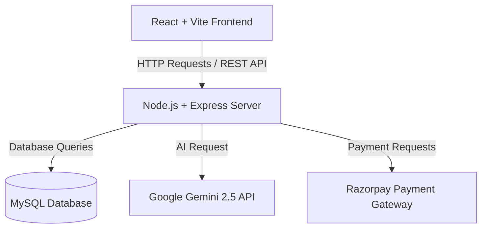

# Eventify - Event Management System Overview

Eventify is a premium, feature-rich Event Management and Ticketing Platform designed to streamline event organization, slot booking, secure payment transactions, and AI-assisted workflows.

## 🌟 Project Motto
> **"Simplifying experiences, amplifying engagements."**  
> To empower managers to craft unique, content-rich events instantly with the help of Generative AI, and allow attendees to discover, book, and securely pay for their slots in a single, fluid interface.

---

## 🛠️ Technology Stack & Architecture

### 1. Frontend
- **Framework**: React (built with Vite for fast HMR)
- **Styling**: Vanilla CSS with custom CSS variables defining a responsive, modern glassmorphic theme.
- **State & Routing**: Memoized callbacks, React hooks (`useState`, `useEffect`, `useCallback`), and conditional tab navigation.

### 2. Backend
- **Framework**: Node.js & Express
- **Authentication**: JSON Web Token (JWT) authorization header-based routing with encrypted password storage using `bcryptjs`.
- **Database**: MySQL database integration handling relational tables for:
  - `users` (Credentials & Roles: user, manager)
  - `events` (Details & persistent custom SVG banners)
  - `bookings` (Event slots registered per user)
  - `payments` (Order IDs, transactions, and amounts)

---

## ⚡ Core Features

### 🏢 Dual-Role Dashboards
- **Manager Account**:
  - Create and publish new events.
  - Delete events.
  - View platform-wide business analytics (ticket sales volume, total registrations, active events list).
- **User Account**:
  - Browse all active public events.
  - Book slots (Free events register instantly).
  - Purchase paid tickets via integrated checkout.
  - Track transaction history and book tickets.

### 💳 Razorpay Payments Integration
- Secure checkout flow:
  1. Frontend triggers payment order creation on Backend.
  2. Backend talks to Razorpay API to obtain a unique `order_id` (converting prices to paise subunit).
  3. Frontend pops open the secure Razorpay Checkout Widget.
  4. Upon successful transaction, payment is verified, stored in the `payments` table, and the attendee slot booking is finalized automatically.

---

## ✨ Generative AI Integrations (Google Gemini)

### ✍️ AI-Generated Descriptions
- Automatically drafts professional, highly engaging description paragraphs for new events using the `gemini-2.5-flash` model, based on the event title, date, time, and venue inputs.

### 🎨 Dynamic SVG Banners
- Generates a customized, theme-matching SVG vector graphic banner for each event based on its title and description.
- The graphic is base64-encoded on the fly, returned as a data URL (`data:image/svg+xml;base64,...`), and saved in the database `events.image_url` column, ensuring it is **completely persistent** and never changes on page refresh.

### 💬 AI Chatbot Assistant
- A custom-tuned floating chatbot widget allowing visitors to search events, ask details about timings/venues/pricing, or suggest event recommendations using dynamic contextual history feeds.
